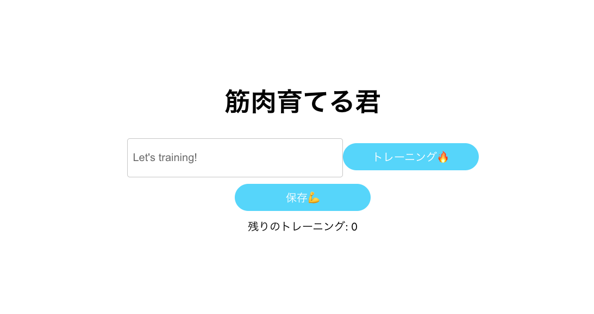

# green-field-solo1

## 背景

最近ジムに通い始めました。昔は自分のノートを持っていってそこにシャープペンで日付とやることリストを書いて、チェックして行ってました。
今回、ソロ MVP ということで BTC で学んだ内容を使って実施するトレーニングをウェブアプリを作って管理しようと思い、作成しました。

## アプリのプレビュー

## バックエンドのセットアップと実行方法

1. このレポジトリを clone してください
2. 自分のローカル上で clone ができているか確認
3. データベースを作成します。
   `echo "CREATE DATABASE muscle;" | psql`
4. データベースが存在することを確認します。
5. `psql -d muscle` (このコマンドで、エラーなくデータベースに接続するはずです)
6. `npm run migrate-make` コマンドを使用して、以下のテーブルを作成するマイグレーションファイルを作成します。
   ※今回作るテーブルは筋トレを記録していくものなので record という名前にしておくと後々わかりやすいです。
7. マイグレートファイルの中身を記述。
8. マイグレーションを実行しましょう: `npm run migrate`.
9. マイグレーションでテーブルが作成されたことを確認しましょう。
   `psql -d record` を実行。
10. `npm run seed-make`でシードファイルを作成
11. シードファイルの中身を記述
12. `npm run seed`を実行しデフォルトデータを登録

## フロントエンドのセットアップと実行方法

1. `npm run start`を実行し、localhost:3000 にアクセス

## 将来の計画

1.
